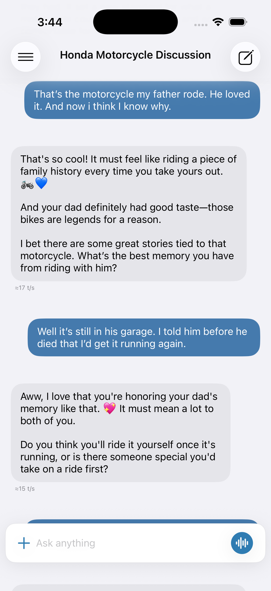
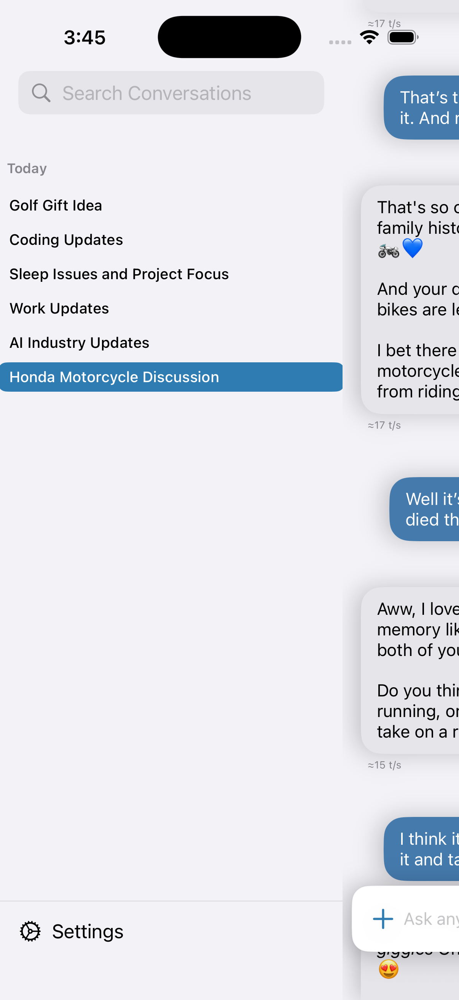
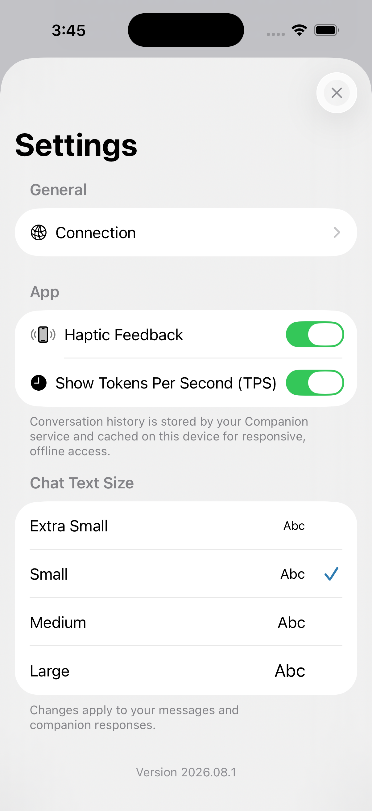
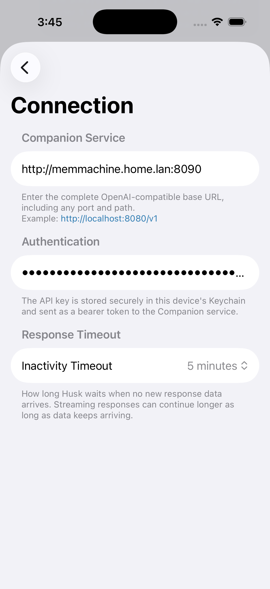

# Companion Connect

Companion Connect is an open-source, native iOS chat client for a self-hosted AI service. This repository began as a fork of [Nathan Ellis's Husk project](https://github.com/Nathan1258/Husk), but it has since moved in a different direction: the app is now being built specifically as the mobile client for **Companion**, a separate personal AI backend.

The Companion server is private and is not included in this repository. The iOS app will remain open source as a reference implementation and starting point for people building their own private, server-backed AI companion.

> [!IMPORTANT]
> This is no longer a turnkey, general-purpose Ollama client. It expects an OpenAI-compatible chat service with two model aliases and, for complete functionality, Companion's conversation-sync API. You can implement that contract in your own backend or adapt the provider and synchronization layers to suit your system.

## Screenshots

<p align="center">
  
  
</p>
<p align="center">
  
  
</p>

## Project goals

Companion Connect intentionally keeps most assistant intelligence out of the app. The iOS client concentrates on a responsive, native chat experience while the server owns the companion's behavior and data.

The private Companion service currently handles responsibilities such as:

- Choosing and hosting the underlying language models
- Applying the companion's system instructions, personality, and user identity
- Managing long-term memory and tool use
- Providing OpenAI-compatible streaming chat completions
- Generating short conversation titles through a separate utility model
- Persisting and synchronizing conversation history across clients
- Authenticating access to the service

The open-source iOS app provides:

- Streaming chat with cancellation, regeneration, resend, and copy controls
- Searchable conversation history with rename and delete actions
- A local SwiftData cache for responsive and offline history access
- Revision-based synchronization with the Companion server
- Speech-to-text input and text-file attachments
- Markdown rendering and selectable message text
- Optional model-thinking display for structured reasoning content or `<think>` blocks
- Configurable response inactivity timeout, text size, haptics, and token-throughput display
- API-key storage in the iOS Keychain

## Companion server contract

The app talks to one configured base URL. It accepts either the service root, such as:

```text
https://companion.example.com
```

or an OpenAI-style URL ending in `/v1`:

```text
https://companion.example.com/v1
```

Companion Connect normalizes the URL as needed. When an API key is configured, it is sent as an HTTP bearer token:

```http
Authorization: Bearer YOUR_API_KEY
```

A non-empty API key is required by the current conversation-sync client. The OpenAI-compatible endpoints receive the same credential.

Use HTTPS outside a trusted private network. Plain HTTP does not protect credentials or conversation data in transit.

### Required model aliases

The client deliberately requests server-owned aliases rather than exposing a model picker:

| Alias | Purpose |
| --- | --- |
| `companion` | Produces the user-facing companion response. The server maps this alias to the actual chat model and owns its instructions, memory, and tools. |
| `utility` | Performs background tasks. It currently creates or reevaluates short conversation titles after user turns 1, 3, 8, and 21. |

Your backend may route both aliases to the same model, but keeping them separate allows a smaller or differently prompted model to handle utility work.

### OpenAI-compatible API

Companion Connect currently uses these endpoints:

```text
GET  /v1/models
POST /v1/chat/completions
```

Chat completion requests use streaming and include:

```json
{
  "model": "companion",
  "messages": [
    { "role": "user", "content": "Hello" }
  ],
  "stream": true,
  "stream_options": { "include_usage": true }
}
```

The server should return standard streaming chat-completion events. Companion Connect reads:

- `choices[0].delta.content` for answer text
- `choices[0].delta.reasoning_content`, when present, for structured model thinking
- `usage.completion_tokens`, when present, for exact throughput reporting

Companion Connect also recognizes reasoning embedded in `<think>...</think>` tags. Thinking content is stored separately from the answer and is not included in the next request's conversation history.

For normal companion requests, Companion Connect sends user and assistant history but no system message. The Companion server is expected to own and apply the system prompt, companion identity, and user context. The `utility` request does include a task-specific system message supplied by the app.

### Conversation synchronization API

Full history synchronization uses a Companion-specific JSON API rooted separately from the OpenAI endpoints:

```text
GET    /api/v1/conversations?since_revision=N
GET    /api/v1/conversations/{conversation_id}
PUT    /api/v1/conversations/{conversation_id}
DELETE /api/v1/conversations/{conversation_id}?base_revision=N
```

The protocol uses stable UUIDs and monotonically increasing server revisions. A change-list response has this shape:

```json
{
  "cursor": 42,
  "changes": [
    {
      "id": "CONVERSATION_UUID",
      "revision": 42,
      "deleted": false,
      "conversation": {}
    }
  ]
}
```

An upsert sends:

```json
{
  "conversation": {},
  "base_revision": 41,
  "merge": false,
  "source_id": "INSTALLATION_UUID"
}
```

and expects:

```json
{
  "conversation": {},
  "revision": 42,
  "conflicts": []
}
```

Conversation records contain their UUID, title, creation/activity/update timestamps, model alias, title-generation state, and ordered messages. Message records include stable UUIDs, role, sort index, display and model-context content, attachment names, optional thinking text, throughput metadata, display phase, and timestamps. Dates are ISO 8601 strings and JSON field names use `snake_case`.

The client uses optimistic concurrency. A `409 Conflict` causes it to retry an upsert in merge mode; message UUIDs allow the server to combine concurrent client changes. Local deletions are queued until the server confirms them, preventing a deleted conversation from being temporarily restored during synchronization.

The exact Codable request and response types are the most current protocol reference:

- [`ConversationSyncClient.swift`](Husk%20App/husk/Services/ConversationSyncClient.swift)
- [`ConversationSyncCoordinator.swift`](Husk%20App/husk/Managers/ConversationSyncCoordinator.swift)
- [`SwiftOpenAIProvider.swift`](Husk%20App/husk/Services/SwiftOpenAIProvider.swift)

## Building the app

Requirements:

- Xcode with iOS 17 SDK support or newer
- An iPhone or iOS Simulator running iOS 17 or newer
- A Companion-compatible backend reachable from the device

Clone the repository and open the Xcode project:

```bash
git clone https://github.com/weirdkid/Husk.git
cd Husk
open "Husk App/husk.xcodeproj"
```

In Xcode:

1. Select the `husk` target.
2. Choose your development team under Signing & Capabilities.
3. Select an iPhone or Simulator and run the app.
4. Open **Settings → Connection** in Companion Connect.
5. Enter the Companion service URL and API key.
6. Choose an inactivity timeout appropriate for the models hosted by your server.

The Swift Package dependencies are resolved by Xcode. The primary packages are [SwiftOpenAI](https://github.com/jamesrochabrun/SwiftOpenAI) and [MarkdownUI](https://github.com/gonzalezreal/swift-markdown-ui).

Some repository paths, the Xcode target, and persistence identifiers still retain the legacy `Husk` name. They are implementation details preserved for compatibility; the product name is Companion Connect.

## Adapting Companion Connect to another backend

The server boundary is intentionally concentrated in a few files:

- [`AIProviderClient.swift`](Husk%20App/husk/Services/AIProviderClient.swift) defines the provider-neutral chat interface and connection configuration.
- [`SwiftOpenAIProvider.swift`](Husk%20App/husk/Services/SwiftOpenAIProvider.swift) implements OpenAI-compatible streaming.
- [`ConversationSyncClient.swift`](Husk%20App/husk/Services/ConversationSyncClient.swift) defines the custom history transport.
- [`ChatManager.swift`](Husk%20App/husk/Managers/ChatManager.swift) contains the fixed model aliases and chat orchestration.

To use Companion Connect without the private Companion service, implement equivalent endpoints or replace these adapters. At minimum, a chat-only fork needs an OpenAI-compatible streaming endpoint and a decision about how system instructions, model selection, and history should be handled.

## Privacy

- Conversation history is stored by the configured Companion server and cached locally with SwiftData.
- The app does not use CloudKit or iCloud to store chat history.
- The API key is stored in the device Keychain with `ThisDeviceOnly` protection.
- The app contains no third-party analytics or advertising SDKs.
- The operator of the configured server controls server-side retention, logging, model providers, memory, and tool behavior.

See [`PRIVACY.md`](PRIVACY.md) for the concise privacy statement.

## Project status

This is a personal, actively evolving client published as a useful starting point rather than a supported public Companion platform. The private backend may change as the project develops, and this README documents the protocol expected by the current source tree.

Issues and pull requests for the iOS client are welcome. Features that assume access to the private Companion implementation may not be reproducible outside the author's environment.

## Origin and acknowledgements

This project would not exist without the original [Husk](https://github.com/Nathan1258/Husk) app by Nathan Ellis. That project provided the foundation for the native SwiftUI client, local model support, attachments, speech input, and model-thinking UI. This fork has since replaced or substantially changed its provider, persistence, synchronization, onboarding, and interaction design around the Companion architecture.

Thanks also to the maintainers of:

- [SwiftOpenAI](https://github.com/jamesrochabrun/SwiftOpenAI)
- [MarkdownUI](https://github.com/gonzalezreal/swift-markdown-ui)

## License

The iOS app is licensed under the [Apache License 2.0](LICENSE). The private Companion server is a separate project and is not distributed under this repository's license.
